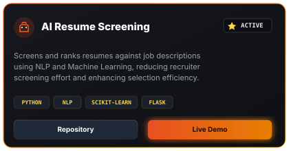
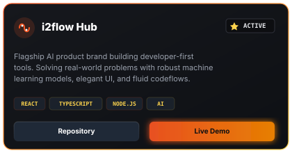
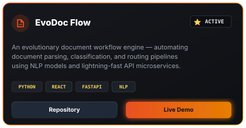
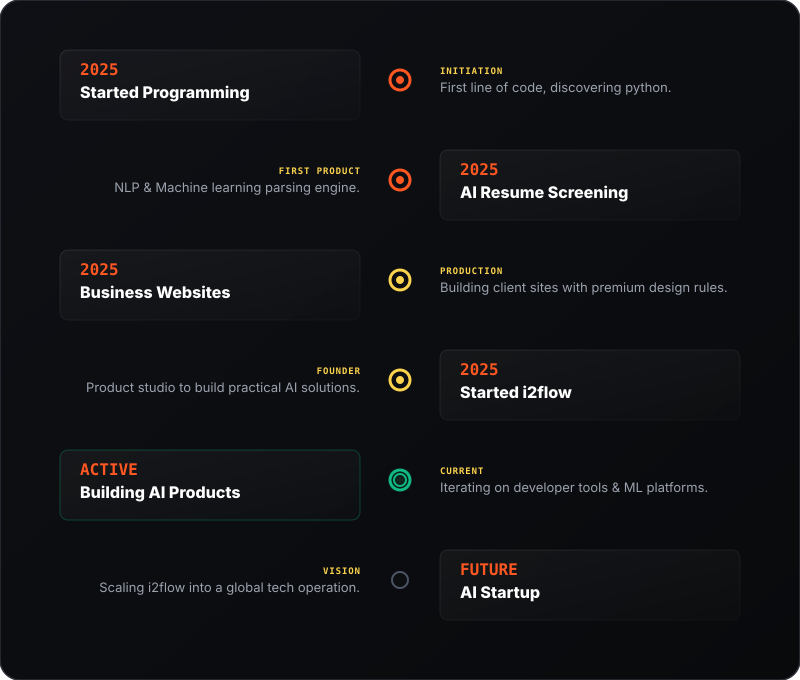
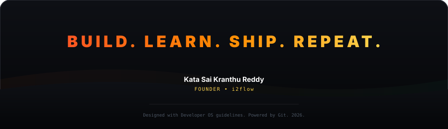

<!-- ════════════════════════════════════════════════════════════════════════ -->
<!--  i2flow · KATA SAI KRANTHU REDDY · PREMIUM GITHUB PROFILE README         -->
<!--  Designed as a futuristic AI Operating System. Apple x Stripe grade.     -->
<!-- ════════════════════════════════════════════════════════════════════════ -->

<a id="top"></a>

<div align="center">

<!-- ① HERO BANNER -->
<a href="https://kskreddy2k7.github.io/kskreddy/">
  
</a>

<br>

<!-- NAVIGATION BAR -->
<table>
  <tr>
    <td align="center" style="background: #0d0e11; border: 1px solid #2e3039; border-radius: 8px; padding: 10px 20px;">
      <a href="#terminal"><code>Terminal</code></a> &nbsp;•&nbsp;
      <a href="#about"><code>Schematic</code></a> &nbsp;•&nbsp;
      <a href="#projects"><code>Products</code></a> &nbsp;•&nbsp;
      <a href="#portfolio"><code>3D Portfolio</code></a> &nbsp;•&nbsp;
      <a href="#skills"><code>Tech Matrix</code></a> &nbsp;•&nbsp;
      <a href="#analytics"><code>Telemetry</code></a> &nbsp;•&nbsp;
      <a href="#timeline"><code>Roadmap</code></a> &nbsp;•&nbsp;
      <a href="#connect"><code>Portals</code></a>
    </td>
  </tr>
</table>

</div>

<br><br>

<!-- ════════════════════════════════════════════════════════════════════════ -->
<!-- ② SYSTEM BOOT SEQUENCE -->
<!-- ════════════════════════════════════════════════════════════════════════ -->
<a id="terminal"></a>
<div align="center">
  
</div>

<br><br>

<!-- ════════════════════════════════════════════════════════════════════════ -->
<!-- ③ SYSTEM SCHEMATIC (ABOUT) -->
<!-- ════════════════════════════════════════════════════════════════════════ -->
<a id="about"></a>
<div align="center">
  
  <br>
  <h2>SYSTEM SCHEMATIC</h2>
  <p><em>Hardware specifications &amp; runtime parameters</em></p>
  <br>
</div>

```ts
const developer: Profile = {
  name: "Kata Sai Kranthu Reddy",
  role: "AI Engineer | Full Stack Developer",
  education: "B.Tech AI & Machine Learning Student",
  founder: "i2flow",
  status: "ONLINE",
  focus: ["Neural Networks", "NLP", "Cinematic UX"],
  mission: "Building AI products that solve real-world problems",
  available_for_work: "Internship Ready",
  stack: ["TypeScript", "Python", "C++", "React", "FastAPI"]
};
```

<br>

<div align="center">
  
</div>

<br><br>

<!-- ════════════════════════════════════════════════════════════════════════ -->
<!-- ④ FEATURED PROJECTS -->
<!-- ════════════════════════════════════════════════════════════════════════ -->
<a id="projects"></a>
<div align="center">
  
  <br>
  <h2>FEATURED CORE PRODUCTS</h2>
  <p><em>Production-grade platforms and intelligent systems</em></p>
  <br>

  <!-- Responsive Project Cards Grid -->
  <table width="100%" cellspacing="10" cellpadding="0">
    <tr>
      <!-- Card 1: AI Resume Screening System -->
      <td width="50%" valign="top">
        <a href="https://github.com/kskreddy2k7/AI-Resume-Screening">
          
        </a>
      </td>
      <!-- Card 2: i2flow -->
      <td width="50%" valign="top">
        <a href="https://github.com/kskreddy2k7/i2flow">
          
        </a>
      </td>
    </tr>
    <tr>
      <!-- Card 3: EvoDoc Flow -->
      <td width="50%" valign="top">
        <a href="https://github.com/kskreddy2k7/EvoDoc-Flow">
          
        </a>
      </td>
      <!-- Spacer/Alignment Cell -->
      <td width="50%" valign="top">
      </td>
    </tr>
  </table>

  <br>

  <!-- Collapsible Section for Other Selected Projects -->
  <details>
    <summary><b>▼ VIEW OTHER SELECTED PROJECTS</b></summary>
    <br>
    <table width="100%">
      <tr>
        <td style="background: #0d0e11; border: 1px solid #2e3039; border-radius: 8px; padding: 15px;">
          <h4><a href="https://github.com/kskreddy2k7/Builderestate">Builderestate</a></h4>
          <p>A premium real-estate platform with structured property listings, location filters, and a conversion-focused interface.</p>
          <code>HTML5</code> • <code>CSS3</code> • <code>JavaScript</code>
        </td>
      </tr>
      <tr>
        <td style="background: #0d0e11; border: 1px solid #2e3039; border-radius: 8px; padding: 15px;">
          <h4><a href="https://github.com/kskreddy2k7/Sri-Sai-Traders">Sri Sai Traders</a></h4>
          <p>A professional storefront business site showcasing hardware product inventory and distribution contact channels.</p>
          <code>HTML5</code> • <code>CSS3</code> • <code>JavaScript</code>
        </td>
      </tr>
      <tr>
        <td style="background: #0d0e11; border: 1px solid #2e3039; border-radius: 8px; padding: 15px;">
          <h4><a href="https://github.com/kskreddy2k7/Nizams-Royal-Restaurant">Nizam's Royal Restaurant</a></h4>
          <p>A cinematic culinary brand page featuring online booking systems, dynamic menus, and royal Mughlai heritage layout.</p>
          <code>HTML5</code> • <code>CSS3</code> • <code>JavaScript</code>
        </td>
      </tr>
    </table>
  </details>

</div>

<br><br>

<!-- ════════════════════════════════════════════════════════════════════════ -->
<!-- ⑤ PORTFOLIO SHOWCASE -->
<!-- ════════════════════════════════════════════════════════════════════════ -->
<a id="portfolio"></a>
<div align="center">
  
  <br>
  <h2>CINEMATIC 3D EXPERIENCE</h2>
  <p><em>Immersive WebGL interactions, interactive animations, and modern brand design.</em></p>
  <br>
  
  <a href="https://kskreddy2k7.github.io/kskreddy/">
    
  </a>
</div>

<br><br>

<!-- ════════════════════════════════════════════════════════════════════════ -->
<!-- ⑥ SKILLS MATRIX -->
<!-- ════════════════════════════════════════════════════════════════════════ -->
<a id="skills"></a>
<div align="center">
  
  <h3 style="margin-top: 15px; margin-bottom: 5px;">TECHNOLOGY MATRIX</h3>
  <p style="margin-top: 0; margin-bottom: 12px;"><em>Core capabilities of the runtime environment</em></p>

  <table width="100%" cellspacing="6" cellpadding="0">
    <tr>
      <td width="33%" valign="top" align="center" style="background: #0e1015; border: 1px solid #2e3039; border-radius: 8px; padding: 10px 5px;">
        
        <div style="height: 6px;"></div>
        
      </td>
      <td width="33%" valign="top" align="center" style="background: #0e1015; border: 1px solid #2e3039; border-radius: 8px; padding: 10px 5px;">
        
        <div style="height: 6px;"></div>
        
      </td>
      <td width="33%" valign="top" align="center" style="background: #0e1015; border: 1px solid #2e3039; border-radius: 8px; padding: 10px 5px;">
        
        <div style="height: 6px;"></div>
        
      </td>
    </tr>
    <tr>
      <td width="33%" valign="top" align="center" style="background: #0e1015; border: 1px solid #2e3039; border-radius: 8px; padding: 10px 5px;">
        
        <div style="height: 6px;"></div>
        
      </td>
      <td width="33%" valign="top" align="center" style="background: #0e1015; border: 1px solid #2e3039; border-radius: 8px; padding: 10px 5px;">
        
        <div style="height: 6px;"></div>
        
      </td>
      <td width="33%" valign="top" align="center" style="background: #0e1015; border: 1px solid #2e3039; border-radius: 8px; padding: 10px 5px;">
        
        <div style="height: 6px;"></div>
        
      </td>
    </tr>
  </table>

</div>

<br><br>

<!-- ════════════════════════════════════════════════════════════════════════ -->
<!-- ⑦ GITHUB ANALYTICS -->
<!-- ════════════════════════════════════════════════════════════════════════ -->
<a id="analytics"></a>
<div align="center">
  
  <br>
  <h2>SYSTEM TELEMETRY</h2>
  <p><em>GitHub activity, language metrics, and performance charts</em></p>
  <br>

  <!-- Stats & Top Languages Side-by-side -->
  <table width="100%">
    <tr>
      <td width="50%" align="center">
        
      </td>
      <td width="50%" align="center">
        
      </td>
    </tr>
  </table>

  <br>

  <!-- Animated contribution grid snake game -->
  <h3>CONTRIBUTION FLOW</h3>
  <picture>
    <source media="(prefers-color-scheme: dark)" srcset="https://raw.githubusercontent.com/kskreddy2k7/kskreddy2k7/output/github-contribution-grid-snake-dark.svg">
    <source media="(prefers-color-scheme: light)" srcset="https://raw.githubusercontent.com/kskreddy2k7/kskreddy2k7/output/github-contribution-grid-snake.svg">
    
  </picture>

  <br><br>

  <!-- Views and Followers Badges -->
  <p>
    
    &nbsp;&nbsp;&nbsp;&nbsp;
    
  </p>

</div>

<br><br>

<!-- ════════════════════════════════════════════════════════════════════════ -->
<!-- ⑧ ROADMAP (TIMELINE) -->
<!-- ════════════════════════════════════════════════════════════════════════ -->
<a id="timeline"></a>
<div align="center">
  
  <br>
  <h2>TEMPORAL ROADMAP</h2>
  <p><em>The progression timeline from system initiation to target objectives</em></p>
  <br>

  
</div>

<br><br>

<!-- ════════════════════════════════════════════════════════════════════════ -->
<!-- ⑨ PORTALS (CONTACT) -->
<!-- ════════════════════════════════════════════════════════════════════════ -->
<a id="connect"></a>
<div align="center">
  
  <br>
  <h2>SYSTEM PORTALS</h2>
  <p><em>Establish communication vectors</em></p>
  <br>

  <table cellspacing="15">
    <tr>
      <td align="center">
        <a href="https://kskreddy2k7.github.io/kskreddy/">
          
          <br>
          <sub><b>Portfolio</b></sub>
        </a>
      </td>
      <td align="center">
        <a href="https://github.com/kskreddy2k7">
          
          <br>
          <sub><b>GitHub</b></sub>
        </a>
      </td>
      <td align="center">
        <a href="https://www.linkedin.com/in/kata-sai-kranthu-reddy-b02848377">
          
          <br>
          <sub><b>LinkedIn</b></sub>
        </a>
      </td>
      <td align="center">
        <a href="https://kskreddy2k7.github.io/i2flow/">
          
          <br>
          <sub><b>i2flow</b></sub>
        </a>
      </td>
      <td align="center">
        <a href="mailto:kskreddy2k7@gmail.com">
          
          <br>
          <sub><b>Email</b></sub>
        </a>
      </td>
      <td align="center">
        <a href="https://www.instagram.com/">
          
          <br>
          <sub><b>Instagram</b></sub>
        </a>
      </td>
    </tr>
  </table>

</div>

<br><br>

<!-- ════════════════════════════════════════════════════════════════════════ -->
<!-- ⑩ SYSTEM TERMINATION (FOOTER) -->
<!-- ════════════════════════════════════════════════════════════════════════ -->
<div align="center">
  
  
  
  <br><br>

  <a href="#top">
    
  </a>

</div>
